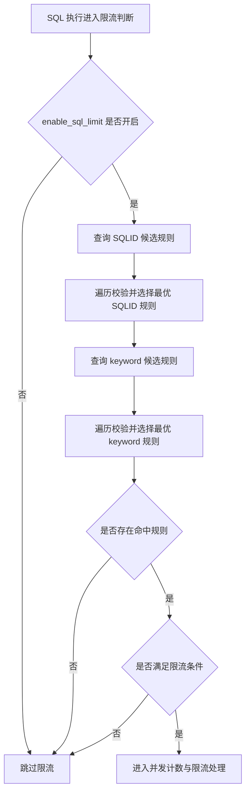
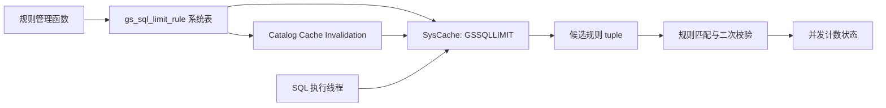
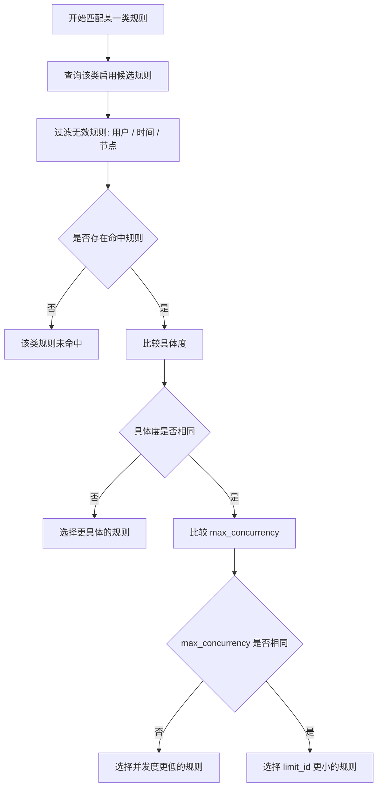

# SQL 限流基于 SysCache 的实现方案

## 实现思路

1. **规则元数据统一存放在系统表**

   SQL 限流规则以 `gs_sql_limit_rule` 作为唯一元数据来源。系统表中保存规则名称、启停状态、规则类型、匹配条件、时间窗口、适用用户和最大并发数等信息。

2. **运行时通过 SysCache 查询候选规则**

   SQL 限流判断发生在 SQL 执行路径上，调用频率较高。为避免每次判断都直接扫描 `gs_sql_limit_rule` 系统表，本方案在规则表上建立适合运行时查询的索引，并将该索引注册为 SysCache。SQL 执行阶段通过 SysCache 查询候选规则，降低 catalog 访问和规则过滤开销。

3. **先判断全局开关，再进入规则匹配**

   执行 SQL 时先检查 GUC `enable_sql_limit`。如果开关关闭，则直接跳过限流逻辑；如果开关开启，则按规则启停状态和规则类型通过 SysCache 查询候选规则。

4. **SQLID 和 keyword 规则均采用候选集遍历**

   对于 SQLID 类型规则，运行时根据 `enable` 和 `limit_type` 查询启用状态下的 SQLID 规则，再遍历候选规则判断当前 SQL 的 `unique_sql_id` 是否命中。

   对于 keyword 类型规则，运行时同样根据 `enable` 和 `limit_type` 查询启用状态下的 keyword 规则，再对 SQL 文本进行关键字匹配。

5. **规则变更依赖系统表缓存失效机制**

   规则的新增、修改、删除仍通过系统表操作完成。SysCache 只作为系统表数据的缓存视图，不保存独立规则状态。规则变更提交后，依赖 openGauss 现有的 catalog cache invalidation 机制使旧缓存失效，后续 SQL 执行重新从 SysCache 获取最新规则。

6. **规则查询和并发计数职责分离**

   并发控制状态不放入 SysCache。SysCache 只负责规则元数据查询，规则命中后进入 SQL 限流的并发计数和阻塞或报错处理流程。

整体匹配流程如下：



## 实现设计

1. **系统表字段设计**

   在 `gs_sql_limit_rule` 中使用 `enable` 字段表示规则是否启用。该字段用于控制规则是否参与运行时匹配。

   规则创建时默认写入 `enable = true`；如果管理函数需要支持创建禁用规则，可在函数参数中增加 `enable` 入参。规则更新时允许修改 `enable`，通过系统表 update 完成规则启停切换。

2. **索引与 SysCache 设计**

   基于运行时查询方式设计系统表索引，并将其注册为 SysCache。运行时查询只使用启停状态和规则类型缩小候选集合，不再使用 SQL hash 作为 SysCache 查询条件，因此索引设计为：

```text
(enable, limit_type, limit_id)
```

   其中，`enable` 用于过滤停用规则，`limit_type` 用于区分 SQLID 和 keyword 规则，`limit_id` 用于保证候选规则具备稳定标识。

   运行时 SQLID 规则查询使用两列 key：

```c
SearchSysCacheList2(GSSQLLIMIT,
    BoolGetDatum(true),
    CStringGetTextDatum(SQLID_TYPE));
```

   keyword 类型规则使用同一个 SysCache 查询启用的 keyword 规则：

```c
SearchSysCacheList2(GSSQLLIMIT,
    BoolGetDatum(true),
    CStringGetTextDatum(limitType));
```

   SysCache 与系统表的关系如下：



3. **规则管理函数设计**

   规则管理函数负责维护系统表数据，不直接操作 SysCache。

   `gs_create_sql_limit_v2` 在完成参数校验后写入 `gs_sql_limit_rule`，包括规则名称、启停状态、规则类型、并发阈值、时间窗口、`unique_sql_id`、keyword 和适用用户等字段。

   `gs_update_sql_limit_v2` 根据 `limit_id` 查找已有规则并更新对应字段；当规则内容变化时同步更新派生字段，并递增 `rule_version`。

   `gs_drop_sql_limit_v2` 根据 `limit_id` 删除规则。

   上述操作均通过系统表 tuple 的 insert、update、delete 完成，规则变更后的缓存刷新由 catalog cache invalidation 机制负责。

4. **运行时匹配设计**

   运行时匹配逻辑在进入限流判断时先检查 `enable_sql_limit`。如果该 GUC 为关闭状态，则直接返回，不查询 SysCache。

   若开启，则通过 SysCache 查询启用状态下的 SQLID 类型候选规则，并遍历候选规则判断当前 SQL 的 `unique_sql_id` 是否命中；同时根据需要查询 keyword 类型候选规则。

   获取候选规则后，继续进行二次校验，包括当前用户是否匹配、当前时间是否处于规则生效时间窗口、SQLID 或 keyword 是否实际匹配，以及并发阈值是否满足限流条件。

5. **优先级设计**

   单条 SQL 对每类规则仅命中一条规则。运行时先在同一类候选规则中完成匹配和优先级比较，选出该类规则下的最优命中规则，避免同类多条规则同时生效导致行为不确定。

   同类规则的优先级按照具体度、并发度和规则标识依次判断。具体度更高的规则优先级更高；具体度相同时，`max_concurrency` 更低的规则优先级更高；如果具体度和 `max_concurrency` 都相同，则 `limit_id` 更小的规则优先级更高。

   SQLID 规则以 `unique_sql_id` 作为匹配条件。对于匹配到同一条 SQL 的多条 SQLID 规则，按照上述优先级规则选择一条最终命中规则。

   keyword 规则的具体度由关键词个数决定。对于同一类 SQL，例如 `select`、`insert`、`update`、`delete`，keyword 为空的规则表示匹配该类型下所有 SQL，具体度最低；keyword 非空的规则表示只匹配包含指定关键词的 SQL，关键词个数越多，规则越具体，优先级越高。

   keyword 规则匹配时先遍历当前 SQL 类型下的启用规则，并完成用户、时间窗口、节点等有效性校验；对于多个同时满足条件的 keyword 规则，依次比较关键词个数、`max_concurrency` 和 `limit_id`，选择优先级最高的一条规则。这样可以保证相同 SQL 在规则集合不变的情况下，每次匹配得到一致的生效规则。

   优先级决策流程如下：



6. **规则启停设计**

   规则启停通过更新 `enable` 字段实现。由于运行时查询条件固定使用 `enable = true`，当规则被更新为 `enable = false` 后，该规则不会再被后续查询命中。

   规则重新启用时，将 `enable` 更新为 `true`，事务提交后后续查询即可重新匹配该规则。整个过程依赖系统表更新触发的缓存失效机制，不需要额外实现规则缓存刷新接口。

7. **状态处理设计**

   SQL 限流规则的元数据查询统一收敛到 SysCache，规则状态仍以系统表为准。运行时只处理启用规则的候选集合，并保持限流规则查询与并发计数处理解耦。
